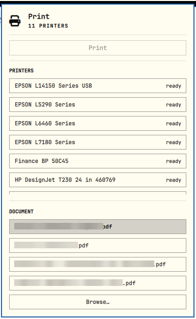

# 1-Click Omarchy Print

An [Omarchy](https://omarchy.org) top-bar button. Click it for a popup panel: pick a printer, pick a PDF (recent ones listed, or Browse…), press Print.

Printers come from CUPS, so anything CUPS sees shows up: network printers
discovered over mDNS/DNS-SD (AirPrint / IPP Everywhere) via Avahi, USB printers,
and manually added queues.



## How it's different

Other Omarchy printer plugins manage printers (settings, queues, toner) or are full print dialogs. This one does a single job:

- **Lives in the top bar.** One click opens a small popup; no launcher, no separate window.
- **Simple.** Pick a printer, pick a PDF, press Print. A4, black and white, one-sided by default; two small switches flip color and two-sided. No page ranges or settings screens.
- **Auto-discovers printers.** Whatever CUPS sees (AirPrint/IPP network, USB) shows up, with the default preselected.
- **Light.** Plain `lp` plus `zenity`; no Python packages, no printer drivers.

If you need toner levels, queue control or page ranges, use one of those plugins alongside this one.

## Quick start

```bash
curl -fsSL https://raw.githubusercontent.com/Darkosxl/1-click-omarchy-print/main/install.sh | bash
```

Installs the dependencies, enables CUPS + Avahi, and adds the widget. Or do it by hand:

## Requirements

```bash
omarchy pkg add cups avahi nss-mdns zenity
sudo systemctl enable --now cups.service avahi-daemon.service
```

On Arch, `nss-mdns` must be in the `hosts:` line of `/etc/nsswitch.conf`
(`mdns_minimal [NOTFOUND=return]` before `resolve`/`dns`). See the
[Arch wiki](https://wiki.archlinux.org/title/CUPS#Network).

## Install

```bash
omarchy plugin add https://github.com/Darkosxl/1-click-omarchy-print.git --enable
```

Move it with `omarchy bar move darkosxl.printer --section right`.

## Use

Click the printer icon. Printers are discovered automatically (the list refreshes every 15 s while open; `r` refreshes now). Click the ☆ next to a printer to favorite it; favorites (★) sort to the top and are remembered in `~/.local/state/omarchy-1-click-print/favorites`. The system default printer is preselected and marked `(default)`. Recent PDFs from `~/Downloads`, `~/Documents` and `~/Desktop` are listed; `Browse…` opens a file picker. `Enter` prints, `Esc` closes.

## Update and remove

```bash
omarchy plugin update darkosxl.printer
omarchy plugin remove darkosxl.printer
```

The installer's packages (cups, avahi, nss-mdns, zenity) are left in place; remove them with `omarchy pkg remove` if unwanted.

## Troubleshooting

| Problem | Check |
|---|---|
| "No printers found" | `lpstat -e`, `lpinfo -v`, both services running |
| Network printer missing | `avahi-browse -art`, same subnet/VLAN as the printer, mDNS not blocked |
| Add a printer by hand | `lpadmin -p Name -E -v ipp://IP/ipp/print -m everywhere` |

Bluetooth printers are not auto-discovered by CUPS; pair and add the queue manually.

## License

MIT
